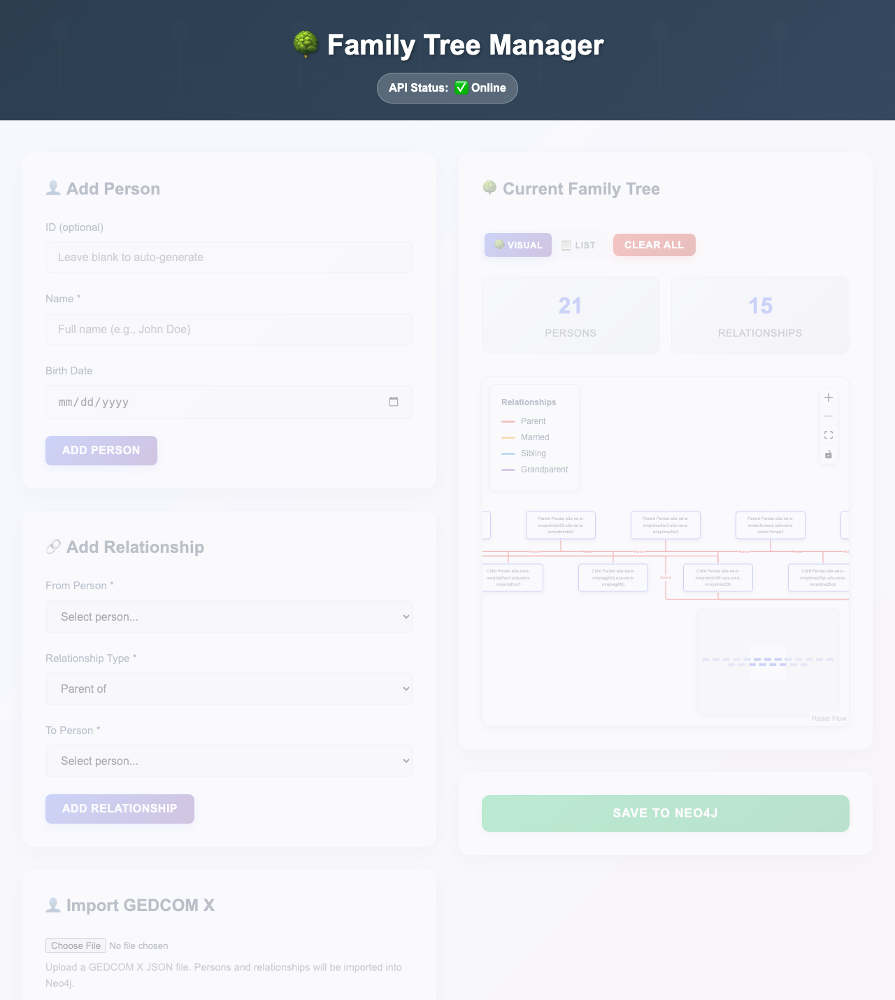

# Family Tree

Full-stack genealogy app backed by Neo4j.

## Screenshot



## Quick Start

Prerequisites: Docker and Docker Compose

```bash
docker compose up
```

- UI: http://localhost:3000
- API: http://localhost:8000
- Neo4j Browser: http://localhost:7474

## Project Structure

```
src/               FastAPI backend
ui/                React/TypeScript frontend
tests/             Backend tests (pytest)
docs/              Documentation
resources/
  prototypes/      Minimal examples (Neo4j, GEDCOM, D3.js)
```

## Development

```bash
# Backend
uv sync && uv run -m pytest

# Frontend
cd ui && npm ci && npm run dev

# E2E
cd ui && npm run e2e
```

## Documentation

- [Neo4j & Cypher](docs/neo4j-cypher.md)
- [GEDCOM Standards](docs/genealogy-standards.md)
- [API Examples](docs/examples.md)
